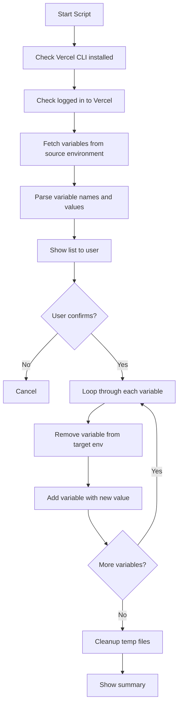

# Vercel Environment Variables Sync Guide

## Overview

Automatically sync environment variables across all Vercel environments (Production, Preview, Development) with a single command. This eliminates the need to manually copy/paste variables in the Vercel dashboard.

## Why This Matters

**Problem:**
- Setting up environment variables in Vercel dashboard is tedious
- Need to manually copy each variable to all 3 environments (Production, Preview, Development)
- Easy to miss variables or have inconsistencies
- Time-consuming when you have many variables

**Solution:**
- One command syncs ALL variables across ALL environments
- Automatic detection and copying
- Consistent configuration everywhere
- Saves hours of manual work

## Available Scripts

We provide 3 implementations for different platforms:

### 1. Node.js Script (Recommended - Cross-Platform)
```bash
npm run env:sync
```

**Advantages:**
- ✅ Works on Windows, macOS, Linux
- ✅ No additional tools needed (Node.js already installed)
- ✅ Integrated with npm scripts
- ✅ Most reliable

### 2. Bash Script (macOS/Linux)
```bash
./scripts/sync-vercel-env.sh
```

**Advantages:**
- ✅ Fast execution
- ✅ Unix-style colored output
- ✅ Lightweight

### 3. PowerShell Script (Windows)
```powershell
.\scripts\sync-vercel-env.ps1
```

**Advantages:**
- ✅ Native Windows support
- ✅ PowerShell-style colored output
- ✅ Windows-optimized

## Quick Start

### Prerequisites

1. **Vercel CLI installed:**
   ```bash
   npm install -g vercel
   ```

2. **Logged in to Vercel:**
   ```bash
   vercel login
   ```

3. **Environment variables set in at least one environment** (usually Production)

### Basic Usage

**Option 1: Using npm (Recommended)**
```bash
# Sync from production to all others (default)
npm run env:sync

# Sync from specific environment
npm run env:sync:preview
npm run env:sync:development
```

**Option 2: Using scripts directly**
```bash
# Node.js
node scripts/sync-vercel-env.js production

# Bash (macOS/Linux)
chmod +x scripts/sync-vercel-env.sh
./scripts/sync-vercel-env.sh production

# PowerShell (Windows)
.\scripts\sync-vercel-env.ps1 -SourceEnv production
```

## How It Works



## Step-by-Step Example

### Scenario: You have 20 environment variables in Production

**Before (Manual Way):**
1. Open Vercel dashboard
2. Go to Project Settings → Environment Variables
3. For each of 20 variables:
   - Copy name
   - Copy value
   - Add to Preview environment
   - Add to Development environment
4. Repeat 60 times (20 vars × 3 steps × 2 environments)
5. Take ~30 minutes

**After (Automated Way):**
```bash
npm run env:sync
# Press 'y' to confirm
# Wait 30 seconds
# Done! ✓
```

## Common Use Cases

### 1. Initial Project Setup

You've set up all variables in Production via Vercel dashboard:

```bash
npm run env:sync
```

This copies everything to Preview and Development.

### 2. Adding New Variables

You added 5 new variables to Production:

```bash
npm run env:sync
```

Only the new variables are synced (existing ones updated if changed).

### 3. Updating Existing Variables

You changed database credentials in Production:

```bash
npm run env:sync
```

All environments get the updated values.

### 4. Preview Environment as Source

Your Preview environment has the correct config:

```bash
npm run env:sync:preview
```

Syncs from Preview to Production and Development.

## What Gets Synced

### Synced Variables ✅
- All environment variables in the source environment
- Both public (`NEXT_PUBLIC_*`) and private variables
- Vercel system variables (if present)
- Custom application variables

### Not Synced ❌
- Git branch associations (these are set in vercel.json)
- Deployment URLs (automatically generated)
- System configuration (handled separately)

## Environment Behavior

After syncing, each deployment uses these variables:

| Branch | Type | URL | Variables Used |
|--------|------|-----|---------------|
| `main` | Production | lucid-merged.vercel.app | Production env vars |
| `staging` | Preview | lucid-merged-git-staging-*.vercel.app | Preview env vars |
| `develop` | Preview | lucid-merged-git-develop-*.vercel.app | Preview env vars |

**Note:** The `environments` config in `vercel.json` can override specific variables per environment type.

## Safety Features

### 1. Confirmation Required
The script always asks for confirmation before syncing:
```
Variables to sync:
  - NEXT_PUBLIC_SUPABASE_URL
  - NEXT_PUBLIC_SUPABASE_ANON_KEY
  - SUPABASE_SERVICE_ROLE_KEY
  - ...

Continue with sync to all environments? [y/N]:
```

### 2. Non-Destructive
- If a variable exists, it's updated (not duplicated)
- If sync fails for one variable, others continue
- Original source environment is never modified

### 3. Temp File Cleanup
- Temporary `.env.temp` files are automatically deleted
- No sensitive data left on disk

## Troubleshooting

### Issue: "Vercel CLI is not installed"

**Solution:**
```bash
npm install -g vercel
```

### Issue: "Not logged in to Vercel"

**Solution:**
```bash
vercel login
```

Follow the prompts to authenticate.

### Issue: "No environment variables found"

**Possible causes:**
1. Source environment has no variables set
2. Wrong project selected
3. Not in project directory

**Solution:**
```bash
# Check current project
vercel project ls

# Link to correct project
vercel link

# Verify variables exist
vercel env ls
```

### Issue: "Failed to sync to [environment]"

**Possible causes:**
1. Network issues
2. Vercel API rate limiting
3. Permission issues

**Solution:**
```bash
# Wait a moment and retry
npm run env:sync

# Check Vercel status
curl https://www.vercel-status.com/

# Verify permissions in Vercel dashboard
```

### Issue: Script hangs or takes too long

**Solution:**
```bash
# Cancel with Ctrl+C
# Check if Vercel CLI is responsive
vercel whoami

# If not responsive, logout and login again
vercel logout
vercel login
```

## Best Practices

### 1. Always Sync from Production
```bash
# ✅ GOOD: Production is source of truth
npm run env:sync

# ⚠️ CAREFUL: Only if Preview has correct values
npm run env:sync:preview
```

### 2. Sync After Adding Variables
Whenever you add variables in Vercel dashboard:
```bash
# Add variables in dashboard
# Then sync immediately
npm run env:sync
```

### 3. Document Your Variables
Keep a `.env.local.example` file:
```bash
# Copy current production env (for reference only)
vercel env pull .env.production --environment=production

# Create example file (remove sensitive values)
cp .env.production .env.local.example
# Edit .env.local.example to remove actual secrets
```

### 4. Verify After Sync
```bash
# Check what's in each environment
vercel env ls

# Should show your variables across all columns:
# NAME                          [production] [preview] [development]
# NEXT_PUBLIC_SUPABASE_URL      ✓            ✓         ✓
# SUPABASE_SERVICE_ROLE_KEY     ✓            ✓         ✓
```

### 5. Don't Sync Secrets to Git
The sync scripts read from Vercel, not from files:
```bash
# ❌ DON'T commit actual .env files
.env.local     # (gitignored)
.env.production # (gitignored)

# ✅ DO commit example files
.env.local.example  # (tracked in git)
```

## Advanced Usage

### Custom Source Environment

Sync from a specific environment:
```bash
# From production (default)
node scripts/sync-vercel-env.js production

# From preview
node scripts/sync-vercel-env.js preview

# From development
node scripts/sync-vercel-env.js development
```

### Selective Sync (Future Feature)

Currently, all variables are synced. To sync only specific variables:

**Workaround:**
1. Manually add/update specific variables in dashboard
2. Or temporarily remove variables you don't want to sync
3. Run sync
4. Re-add the removed variables

**Future enhancement:**
```bash
# Planned feature (not yet implemented)
npm run env:sync -- --only="NEXT_PUBLIC_*"
npm run env:sync -- --exclude="SECRET_*"
```

## Integration with CI/CD

### GitHub Actions Example

```yaml
name: Sync Vercel Environment Variables

on:
  workflow_dispatch: # Manual trigger
  
jobs:
  sync-env:
    runs-on: ubuntu-latest
    steps:
      - uses: actions/checkout@v4
      
      - name: Setup Node.js
        uses: actions/setup-node@v4
        with:
          node-version: '20'
      
      - name: Install Vercel CLI
        run: npm install -g vercel
      
      - name: Sync Environment Variables
        run: |
          echo "${{ secrets.VERCEL_TOKEN }}" | vercel login --token
          npm run env:sync
        env:
          VERCEL_TOKEN: ${{ secrets.VERCEL_TOKEN }}
```

### Local Pre-Deploy Hook

Add to `.git/hooks/pre-push`:
```bash
#!/bin/bash
echo "Would you like to sync environment variables? [y/N]"
read -r response
if [[ "$response" =~ ^([yY][eE][sS]|[yY])$ ]]; then
    npm run env:sync
fi
```

## Performance

Typical sync times:

| Variables | Time |
|-----------|------|
| 10 vars | ~15 seconds |
| 20 vars | ~30 seconds |
| 50 vars | ~1.5 minutes |
| 100 vars | ~3 minutes |

**Factors affecting speed:**
- Number of variables
- Vercel API response time
- Network latency
- Variable value size

## Security Considerations

### What's Safe ✅
- Scripts never store secrets permanently
- Temp files are automatically cleaned up
- Only reads from Vercel API (same as dashboard)
- Requires authentication (vercel login)

### What to Avoid ❌
- Don't run scripts on untrusted machines
- Don't commit actual `.env` files
- Don't share script output (may contain secrets)
- Don't run in public CI without secrets protection

### Best Practice
```bash
# Run sync on your local machine
npm run env:sync

# Or in secure CI with proper secrets management
# (Vercel token stored as GitHub secret)
```

## Comparison with Manual Dashboard Approach

| Feature | Manual Dashboard | Automated Sync |
|---------|-----------------|----------------|
| Time for 20 variables | ~30 minutes | ~30 seconds |
| Error-prone | High (copy/paste errors) | Low (automated) |
| Consistency | Manual verification needed | Guaranteed |
| Scalability | Poor (100 vars = hours) | Excellent (constant time) |
| Learning curve | Easy | Easy (one command) |
| Maintenance | High (repeat for each var) | Low (single command) |

## FAQ

### Q: Will this overwrite my existing variables?
**A:** Yes, if a variable with the same name exists, it will be updated with the value from the source environment.

### Q: Can I undo a sync?
**A:** No automatic undo. Best practice: verify variables before syncing, or keep a backup of your .env file.

### Q: Does this affect deployments?
**A:** Variables are updated immediately, but deployments use the values that were set at deploy time. Redeploy to use new values.

### Q: Can I sync between different projects?
**A:** No, this script only syncs within the current project. To sync between projects, manually copy variables.

### Q: What about Vercel secrets (@ syntax)?
**A:** Secrets (e.g., `@sentry-dsn`) are handled separately. This script syncs regular environment variables.

## Related Documentation

- [Vercel Environment Variables Docs](https://vercel.com/docs/projects/environment-variables)
- [docs/VERCEL_ERROR_MANAGEMENT_CONFIG.md](./VERCEL_ERROR_MANAGEMENT_CONFIG.md) - vercel.json configuration
- [docs/DEPLOYMENT_PIPELINE_SETUP.md](./DEPLOYMENT_PIPELINE_SETUP.md) - Complete deployment guide

## Support

**Issues?**
1. Check the troubleshooting section above
2. Verify Vercel CLI is up to date: `vercel --version`
3. Try logging out and back in: `vercel logout && vercel login`
4. Check Vercel status: https://www.vercel-status.com/

## Summary

**Quick Commands:**
```bash
# Install Vercel CLI
npm install -g vercel

# Login
vercel login

# Sync environment variables
npm run env:sync

# Done! ✓
```

**Benefits:**
- ✅ Save hours of manual work
- ✅ Eliminate copy/paste errors
- ✅ Ensure consistency across environments
- ✅ One command to sync everything
- ✅ Works on all platforms (Windows/macOS/Linux)
