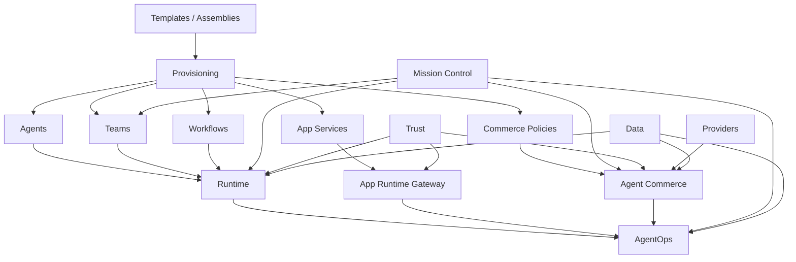

# Lucid Stack Architecture

**Status:** Active architecture boundary
**Last updated:** 2026-05-02
**Shared stack IDs:** `contracts/stack.ts`
**App metadata:** `src/config/lucid-stacks.ts`

LucidMerged is a composable agent platform. The repo should stay one coherent monorepo for now, but the product must be organized as explicit stacks with stable ownership, contracts, and dependency rules.

This directory is the source of truth for those stack boundaries. It is intentionally lighter than a physical repo reorganization: it gives us clarity now without moving large route, DB, worker, or contract surfaces prematurely.

`contracts/stack.ts` intentionally contains only the stable stack IDs. Rich stack ownership and surface metadata belongs in app/docs configuration so the shared app/worker contract boundary stays small.

## Stack Map

| Stack | Purpose | Canonical doc |
| --- | --- | --- |
| Agent Commerce | Agent spend, seller grants, machine payments, policy, ledger, reconciliation | `docs/stacks/commerce.md` |
| AgentOps | Traces, events, health, costs, approvals, incidents, remediation signals | `docs/stacks/agentops.md` |
| Mission Control | Operator cockpit and control plane UX | `docs/stacks/mission-control.md` |
| Teams | Multi-agent actor graph, currently backed by crew contracts/tables | `docs/stacks/teams.md` |
| Templates / Assemblies | Deployable product assemblies for agents, teams, apps, workflows, policies | `docs/stacks/templates.md` |
| Runtime | Engine-neutral execution for OpenClaw, Hermes, shared worker, dedicated and BYO runtimes | `docs/stacks/runtime.md` |
| App Service | Generated/hosted app services and public/operator runtime APIs | `docs/stacks/app-service.md` |
| Trust | Auth, authorization, approvals, policy, secrets, credentials, entitlement | `docs/stacks/trust.md` |
| Data | Migrations, ledgers, events, queues, locks, memory, durable state | `docs/stacks/data.md` |
| Providers | External provider adapters and provider manifests | `docs/stacks/providers.md` |

## Composition Model

## Rules

1. **Contracts first.** Shared schemas live under `contracts/` and must remain framework-free.
2. **Stack docs before stack moves.** New cross-cutting work must update the relevant stack doc before moving files or renaming public surfaces.
3. **Provider-neutral core.** Provider SDKs belong in provider adapters, not runtime tools, contracts, generated apps, or policy engines.
4. **Runtime agnostic by default.** Runtime tools expose Lucid capabilities through internal APIs or contracts, not engine-specific objects.
5. **AgentOps is the operational substrate.** Stacks emit events and traces to AgentOps; Mission Control renders and controls them.
6. **Templates are assemblies.** Templates should evolve from starter prompts into deployable assemblies that can install agents, teams, workflows, integrations, approvals, evals, and commerce policies.
7. **Repo reorg is gated.** Broad physical reorganization stays in backlog until stack ownership, dependency tests, and migration paths are explicit.

## Physical Repo Guidance

Use the existing repo layout while stack contracts harden:

- `contracts/` for shared framework-free schemas.
- `src/lib/<stack>/` for Next/control-plane domain logic.
- `src/app/api/<stack-or-route-family>/` for public/internal API surfaces.
- `worker/src/<stack-or-runtime-area>/` for worker execution and runtime tools.
- `packages/` for reusable SDKs, bridges, and publishable runtime surfaces.
- `supabase/migrations/` and `docker/bootstrap/` for durable data changes.
- `docs/stacks/` for stack ownership and dependency rules.

The target is not a prettier file tree. The target is a codebase where new capabilities can be composed without knowing every historical route name.

## Reorg Decision

The repo stays in its current monorepo layout until the accepted reorg gates in `docs/superpowers/adrs/2026-05-02-stack-architecture-and-reorg-gates.md` are satisfied.

Current decisions:

- Do not split Agent Commerce into a separate repo before contracts, ledgers, API routes, runtime tools, provider adapters, reconciliation, dashboards, and security gates are stable.
- Do not introduce a top-level physical `stacks/` directory yet. `docs/stacks/` is the stack map; code continues to use existing route/library/worker/package layout.
- Do not perform broad physical moves without an ADR or migration note, stack doc updates, boundary test updates, compatibility aliases where needed, and a rollback path.
- Do not rename `crew` tables/routes/contracts to `team` without the dedicated compatibility plan in `docs/superpowers/specs/2026-05-02-crew-to-team-compatibility-migration.md`.
