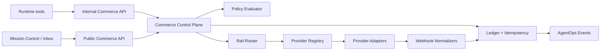

# Agent Commerce Stack

**Status:** Preview bridge
**Contract:** `contracts/agent-commerce.ts`
**Stack ID:** `commerce`

Agent Commerce is Lucid's provider-neutral commerce control plane for agent-mediated buying, seller-side agentic checkout, machine payments, and paid app/API access.

The stack must make this question answerable and auditable:

> Can this agent spend or accept money for this user, org, app, run, merchant, endpoint, amount, and rail?

## Owns

- Commerce intents and spend requests.
- Rail policy routing.
- Spend policy evaluation.
- Human approval requirements.
- Provider-neutral commerce provider interfaces.
- Credential issuance records by secret reference, never raw credentials.
- Seller grants and paid endpoint challenges.
- Machine-payment proof claim semantics.
- Commerce ledger, idempotency, budget reservation, webhook normalization, reconciliation events.
- Commerce Knowledge evidence for spend decisions, budget reservations, seller grants, provider events, proof claims, and reconciliation outcomes.

## Does Not Own

- Human subscription checkout for Lucid plans.
- Raw provider credential storage.
- Runtime engine execution loops.
- General org membership/authentication.
- Provider SDK lifecycle outside adapter boundaries.

## Current Surfaces

- `contracts/agent-commerce.ts`: provider-neutral schemas.
- `src/lib/agent-commerce/`: provider registry, provider interfaces, policy evaluator, manual provider, env-gated Stripe SPT provider, and provider manifests.
- `src/lib/payments/stripe-provider.ts`: existing human-checkout abstraction; Commerce must not collapse into this.
- `worker/src/services/x402/`: current x402 client reference surface.
- Mission Control Commerce: spend/request detail drawer with Knowledge row provenance, event payload summary, entity snapshot, run/request/provider ids, idempotency, budget, seller, ledger, and attach-to-context actions.
- Shared operating context links: Commerce evidence can be attached to workspace/project/team thesis, signal, feedback, Daily Intel, risk, and memory records.
- `docs/superpowers/specs/2026-05-01-agent-commerce-architecture-design.md`: detailed Agent Commerce design spec.
- `docs/BACKLOG.md`: implementation and Lucid-L2 safety gates.

## Required Architecture

## Integration Rules

- Runtime tools call internal Commerce APIs; they never import Stripe, x402 facilitator, wallet, or card SDKs directly.
- Provider adapters accept Lucid domain objects and return Lucid domain objects.
- The Rail Router returns a decision with reason codes; it does not execute side effects.
- Ledger writes, budget reservations, and proof claims must be atomic and fail closed.
- Every spend lifecycle transition emits an AgentOps event.
- Mission Control is the approval and operator visibility surface.
- App Service can expose paid public actions only through Commerce seller middleware.
- Templates may declare default commerce policies, but deployment still enforces Trust checks.
- Live rail readiness must count only provider adapters whose manifests are `live`; preview and manifest-only rails remain excluded from GA readiness.
- Every durable Commerce event should be recorded as `commerce_event` Knowledge evidence with provider, project, assistant, run, request, outcome, status, amount, currency, idempotency, and entity provenance when available.

## First-Class Flows

1. **Buyer-agent spend request**
   - Agent proposes a purchase.
   - Commerce validates policy and route.
   - Mission Control or Inbox resolves approval if needed.
   - Commerce reserves budget before the provider adapter issues a credential or redirects.
   - Ledger reconciles provider events.

2. **Seller-side agentic checkout**
   - Lucid exposes a product, app action, MCP resource, or API endpoint.
   - Agent/browser receives a machine-readable offer or payment challenge.
   - Commerce validates grant/proof and accepts seller grants through env-gated provider adapters.
   - Entitlements or endpoint access are granted.

3. **Generated app paid action**
   - App Service declares a paid public action.
   - App Runtime Gateway asks Commerce for challenge/settlement state.
   - Commerce emits AgentOps traces and ledger events.

## Knowledge Evidence

`appendAgentCommerceEvent()` writes to `agent_commerce_events` and mirrors the event into `knowledge_operation_events` as `commerce_event` evidence. The adapter enriches evidence from the underlying Commerce entity when possible:

- spend requests: project, assistant, run, tool call, idempotency key, provider request, amount, currency, merchant, and status
- seller grants and entitlements: seller grant, resource, entitlement target, payment, amount, currency, and status
- machine challenges and proof claims: resource, payment proof, replay/claim outcome, and status
- provider and connection events: provider, connection, provider event id, request id, and actor

This evidence is discoverable through Global Search under the `commerce` scope and can be attached to shared operating context records as a `commerce_event` link. Mission Control Commerce shows the full provenance bundle and returns a direct "Context attached" link after attach. Manual Daily Intel generation automatically considers recent `commerce_event` evidence for the selected workspace, project, or team. Agents can cite Commerce outcomes in thesis, feedback, Daily Intel, and risk records without reading provider secrets or raw payment objects.

## Forbidden Dependencies

- Provider object models must not become core contracts.
- Lucid-L2 public money-moving routes must not become production execution paths until P0 gates in `docs/BACKLOG.md` are closed.
- Runtime tools must not receive raw payment credentials.
- Generated apps must not call internal Commerce/provider routes directly.

## Lucid-L2 P0 Execution Gate

Lucid-L2 remains protocol source material while `P0-L2-001`, `P0-L2-002`, and `P0-L2-003` are open in `docs/BACKLOG.md`. LucidMerged must fail closed for any Lucid-L2-derived wallet or trading execution unless all of the following are set together:

- `AGENT_COMMERCE_LUCID_L2_EXECUTION_ENABLED=true`
- `AGENT_COMMERCE_LUCID_L2_P0_GATES_CLOSED=true`
- `AGENT_COMMERCE_LUCID_L2_SECURITY_REVIEW_REF=<review-or-release-reference>`

The local gate is implemented in `src/lib/agent-commerce/lucid-l2-p0-gates.ts`, enforced by the crypto wallet execution guard, and checked in CI with `npm run agent-commerce:l2-gates`. Setting the env flags is release evidence, not a code bypass: the upstream Lucid-L2 P0 backlog items stay open until those issues are fixed and reviewed at source.

## Near-Term Implementation

- Map completed seller grants into Lucid plan, app-service, and API entitlement ledgers before broad paid access.
- Add refund/reversal handling for seller grants.
- Keep Stripe SPT execution disabled unless account access, webhook signing, and feature flags are configured.
- Keep Link Agents, Issuing, MPP, x402, and crypto wallet execution manifest-only until their provider adapters satisfy the same ledger and reconciliation rules.
