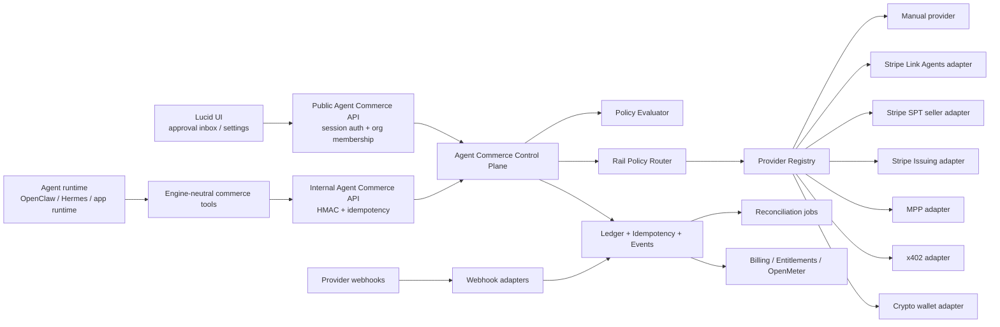
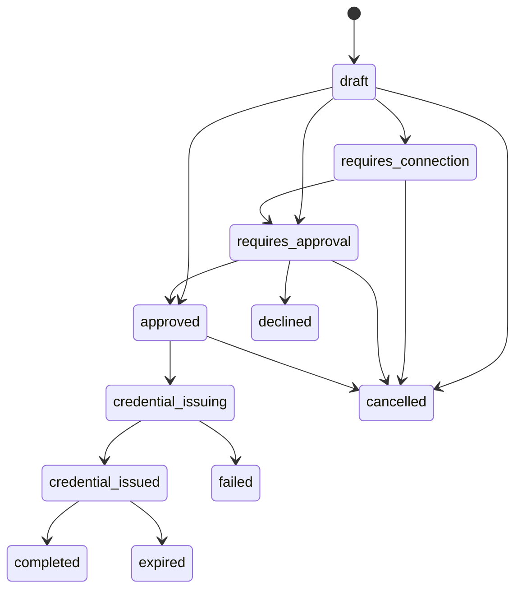
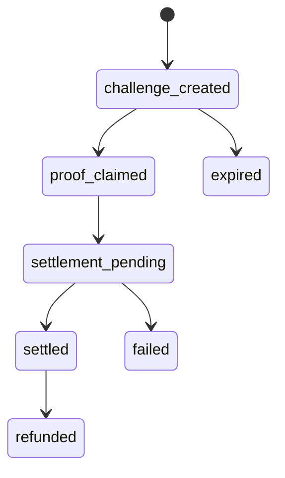

# Lucid Agent Commerce Architecture Design Spec

**Date:** 2026-05-01
**Status:** Design spec ready for implementation
**Owner:** Agent Commerce / Platform
**Plan:** `docs/superpowers/plans/2026-05-01-agent-commerce-link-and-machine-payments-plan.md`
**ADR:** `docs/superpowers/adrs/2026-05-01-agent-commerce-provider-neutral-architecture.md`
**Backlog:** `docs/BACKLOG.md`
**Stack doc:** `docs/stacks/commerce.md`
**Stack ID:** `contracts/stack.ts` (`commerce`)

## 1. Problem Statement

LucidMerged has agent runtimes, wallet/session-signer infrastructure, x402 client support, Stripe billing, generated app services, and Lucid-L2 protocol source material. What it does not yet have is one safe, provider-neutral commerce layer that can answer:

- Can this agent spend money for this user or org?
- Which payment rail is allowed for this merchant, amount, country, currency, endpoint, and risk level?
- Who approved it?
- Which credential was issued?
- Did the merchant/API receive payment?
- Did the ledger, billing system, provider, and runtime all agree?

Agent Commerce solves this by creating a Lucid-owned commerce control plane. Providers execute rails, but Lucid owns intent, policy, approval, idempotency, audit, and reconciliation.

## 2. Product Vision

Lucid Agent Commerce is a **Commerce Fabric**:

- Agent runtimes ask for commerce outcomes, not provider-specific payment artifacts.
- Users and org admins define policy once, then apply it across engines, agents, app services, and providers.
- Providers are swappable adapters.
- Every spend is traceable from prompt/run/tool call to provider event and entitlement.
- Seller-side machine payments turn Lucid APIs, MCP tools, app services, and generated apps into agent-payable products.

The competitive edge is not "Stripe integration." The edge is the control layer around any rail:

- policy-first rail routing
- engine/runtime agnosticism
- two-sided commerce
- atomic machine-payment proofs
- ledger-first provider adapters
- clear OSS boundaries and provider portability

## 3. Market Landscape

| Rail / Protocol | Best for | Lucid stance |
| --- | --- | --- |
| Stripe Link Agents | User-owned wallet approvals, one-time-use cards, SPTs | First-class adapter when stable account/API access is available. Manifest-only until then. |
| Stripe Agentic Commerce / ACP | Agent/seller product discovery, carts, checkout, SPT handoff | Support as seller and later as agent-platform surface; keep ACP-specific logic out of core contracts. |
| Stripe Shared Payment Tokens | Seller receives scoped payment credential from an agent | Strong first seller-side candidate for Lucid plan/app/API purchases. |
| Stripe Issuing for agents | Platform-owned virtual cards, spend controls, real-time authorizations | Optional advanced rail for Lucid-owned or platform-owned agents. Must require real-time auth and policy. |
| Stripe MPP | HTTP 402 machine payments with SPT or crypto paths | Good for agent-payable APIs and MCP resources; keep behind machine-payment adapter. |
| pay.sh / Solana Foundation `pay` | Wallet-approved HTTP 402 client/gateway for MPP and x402, plus paid API discovery through pay-skills | Candidate optional machine-payment gateway/client adapter and sandbox DX layer; do not make it the core ledger, policy engine, or Stripe replacement. |
| x402 | HTTP-native stablecoin payments, especially low-value API access | Strong machine-payment rail; requires atomic proof claim and replay protection. |
| Coinbase x402 facilitator | Facilitator for x402 verification/settlement | Candidate facilitator provider; must be adapter-owned. |
| Google AP2 / UCP | Mandates, agent payments, product discovery and checkout interoperability | Track as protocol capability; do not couple core to AP2-specific mandates yet. |
| Lucid-L2 | Receipts, passports, facilitators, x402 semantics, agent-wallet patterns | Source material only until `docs/BACKLOG.md` P0 gates are closed. |

## 4. Scope

### In Scope

- Buyer-agent spend requests.
- User/org approval and policy.
- Rail selection.
- Provider-neutral adapter interfaces.
- Stripe Link Agents manifest and future adapter.
- Stripe SPT seller acceptance.
- MPP/x402 machine-payment middleware.
- Manual provider for local development and preview.
- Durable ledger and event model.
- Runtime tools for OpenClaw, Hermes, and generated apps.
- Mission Control / operator observability.
- Reconciliation, webhooks, and replay-safe proof handling.

### Out of Scope

- Replacing normal Stripe Checkout for human plan purchases.
- Storing raw card, SPT, OAuth, or wallet credentials in app rows.
- Exposing Lucid-L2 public money-moving routes.
- Letting worker/runtime tools import Stripe SDKs.
- Letting one provider's object model become the Lucid domain model.
- Fully autonomous spend by default.

## 5. Current Repo Baseline

Already present:

- `contracts/stack.ts`: shared Lucid stack IDs, including `commerce`, `agentops`, `mission_control`, `teams`, `templates`, `runtime`, `app_service`, `trust`, `data`, and `providers`.
- `src/config/lucid-stacks.ts`: app-side stack definitions with ownership, surfaces, dependencies, and backlog refs.
- `docs/stacks/commerce.md`: stack boundary, ownership, integration rules, and forbidden dependencies for Agent Commerce.
- `contracts/agent-commerce.ts`: initial Zod contracts.
- `src/lib/agent-commerce/provider.ts`: provider interfaces.
- `src/lib/agent-commerce/provider-registry.ts`: in-memory registry.
- `src/lib/agent-commerce/policy.ts`: basic policy evaluator.
- `src/lib/agent-commerce/providers/manual.ts`: manual provider skeleton.
- `src/lib/agent-commerce/providers/stripe-link.ts`: Stripe provider manifests.
- `src/lib/features.ts`: Agent Commerce flags.
- `src/lib/payments/stripe-provider.ts`: existing human checkout provider abstraction.
- `src/lib/session-signers/index.ts`: agent wallet signing/transaction paths.
- `worker/src/services/x402/index.ts`: worker x402 client path.
- `docs/BACKLOG.md`: Lucid-L2 P0/P1 safety gates.

Missing:

- Stack ID tagging on new Agent Commerce events.
- Durable Agent Commerce DB schema.
- Rail Router.
- Ledger/idempotency/proof claim RPCs.
- Control-plane APIs.
- Webhook handlers.
- Runtime commerce tools.
- UI approval flow.
- Provider adapters beyond manifest/manual skeleton.
- Reconciliation jobs.
- Security and observability gates.

## 6. Architecture Overview

Agent Commerce is implemented as the `commerce` Lucid stack. It composes with:

- `trust` for identity, approvals, policy, secrets, and fail-closed rules.
- `agentops` for traces, feed events, provider health, and reconciliation alerts.
- `runtime` for engine-neutral agent tools.
- `app_service` for paid generated-app/public-action surfaces.
- `providers` for Stripe, x402, crypto, manual, and future rail adapters.
- `data` for ledger, idempotency, proof claims, and webhook dedupe.



## 7. Bounded Contexts

### Commerce Intent

The normalized request for commerce. It contains what the agent wants to do, not how the payment happens.

Required fields:

- `intent_id`
- `org_id`
- `project_id`
- `assistant_id`
- `run_id`
- `tool_call_id`
- `actor_user_id`
- `merchant`
- `amount`
- `currency`
- `purpose`
- `resource`
- `seller`
- `requested_capabilities`
- `idempotency_key`
- `created_at`
- `expires_at`

### Rail Policy Router

Pure decision service. It returns a decision and reason codes. It does not execute provider side effects.

### Ledger

Durable source of truth for local state, idempotency, budget reservation, proof redemption, provider IDs, reconciliation, and audit events.

### Provider Adapter

Owns provider SDK calls, provider-specific object mapping, provider webhooks, and provider-specific failure handling. Adapters must accept Lucid domain objects and return Lucid domain objects.

### Runtime Tools

Expose commerce actions to agents without provider credentials or SDK imports.

### Seller Middleware

Turns Lucid APIs, MCP tools, app services, and generated app endpoints into paid resources through MPP/x402/SPT/manual grants.

## 8. Domain Model

### Tables

#### `agent_commerce_connections`

Stores user/org/provider connection metadata.

Columns:

- `id uuid primary key`
- `org_id uuid not null`
- `user_id uuid`
- `provider text not null`
- `provider_account_id text`
- `provider_connection_id text`
- `status text not null`
- `capabilities jsonb not null default '[]'`
- `secret_ref text`
- `created_at timestamptz`
- `updated_at timestamptz`
- `expires_at timestamptz`
- `metadata jsonb not null default '{}'`

Statuses:

- `pending`
- `active`
- `revoked`
- `expired`
- `disabled`
- `failed`

#### `agent_commerce_policies`

Stores org/project/assistant/user policy layers.

Columns:

- `id uuid primary key`
- `org_id uuid not null`
- `scope_type text not null`
- `scope_id uuid`
- `policy jsonb not null`
- `is_active boolean not null default true`
- `created_by uuid`
- `created_at timestamptz`
- `updated_at timestamptz`

Scope types:

- `org`
- `project`
- `assistant`
- `user`
- `seller_endpoint`
- `generated_app`

#### `agent_spend_requests`

Durable buyer-agent spend request.

Columns:

- `id uuid primary key`
- `org_id uuid not null`
- `project_id uuid`
- `assistant_id uuid`
- `user_id uuid`
- `run_id text`
- `tool_call_id text`
- `idempotency_key text not null`
- `provider text not null`
- `rail text not null`
- `status text not null`
- `merchant jsonb not null`
- `amount_cents integer not null`
- `currency text not null`
- `context text not null`
- `policy_snapshot jsonb not null`
- `router_decision jsonb not null`
- `provider_request_id text`
- `provider_credential_id text`
- `credential_kind text`
- `approval_required boolean not null default true`
- `approved_by uuid`
- `approved_at timestamptz`
- `expires_at timestamptz`
- `created_at timestamptz`
- `updated_at timestamptz`
- `completed_at timestamptz`
- `metadata jsonb not null default '{}'`

Unique constraints:

- `(org_id, idempotency_key)`
- `(provider, provider_request_id)` where not null

#### `agent_commerce_credentials`

Stores safe display and secret references for issued credentials.

Columns:

- `id uuid primary key`
- `spend_request_id uuid not null`
- `org_id uuid not null`
- `provider text not null`
- `kind text not null`
- `status text not null`
- `secret_ref text`
- `display jsonb`
- `usage_limits jsonb not null`
- `expires_at timestamptz`
- `created_at timestamptz`
- `revoked_at timestamptz`
- `metadata jsonb not null default '{}'`

#### `seller_payment_grants`

Stores inbound payment grants when Lucid is the seller.

Columns:

- `id uuid primary key`
- `org_id uuid not null`
- `provider text not null`
- `rail text not null`
- `grant_id text not null`
- `status text not null`
- `customer_reference text`
- `resource_type text not null`
- `resource_id text`
- `amount_cents integer not null`
- `currency text not null`
- `usage_limits jsonb not null`
- `provider_payment_id text`
- `entitlement_ref text`
- `expires_at timestamptz`
- `created_at timestamptz`
- `updated_at timestamptz`
- `metadata jsonb not null default '{}'`

Unique constraints:

- `(provider, grant_id)`
- `(provider, provider_payment_id)` where not null

#### `agent_commerce_seller_entitlements`

Durable seller-side access ledger created only after a seller grant is locally completed and provider state agrees.

Columns:

- `id uuid primary key`
- `org_id uuid not null`
- `seller_grant_id uuid not null`
- `provider text not null`
- `resource_type text not null`
- `resource_id text`
- `status text not null`
- `target_type text not null`
- `target_id uuid`
- `payment_id uuid`
- `effective_at timestamptz`
- `expires_at timestamptz`
- `revoked_at timestamptz`
- `revoke_reason text`
- `metadata jsonb not null default '{}'`

Rules:

- exactly one entitlement row per seller grant;
- plan grants link to `subscriptions` and `payments`;
- app/API/usage grants stay provider-neutral through entitlement rows;
- refunds, disputes, and token revocations call the revoke RPC before paid access remains available.

#### `agent_commerce_rate_limit_buckets`

Atomic route-abuse ledger for public and internal Agent Commerce mutation APIs.

Rules:

- bucketed by org plus user, assistant, provider, grant, or machine-payment resource;
- claimed through `claim_agent_commerce_rate_limit`;
- checked before provider side effects and before durable money-state mutation.

#### `machine_payment_challenges`

Stores HTTP 402 challenge records.

Columns:

- `id uuid primary key`
- `org_id uuid not null`
- `provider text not null`
- `rail text not null`
- `resource_type text not null`
- `resource_id text not null`
- `amount_cents integer not null`
- `currency text not null`
- `challenge_hash text not null`
- `challenge_body jsonb not null`
- `status text not null`
- `expires_at timestamptz not null`
- `created_at timestamptz not null`
- `metadata jsonb not null default '{}'`

Unique constraints:

- `(provider, challenge_hash)`

#### `machine_payment_proof_claims`

Stores atomic proof claims.

Columns:

- `id uuid primary key`
- `challenge_id uuid not null`
- `org_id uuid not null`
- `provider text not null`
- `proof_hash text not null`
- `status text not null`
- `provider_payment_id text`
- `claimed_at timestamptz not null`
- `settled_at timestamptz`
- `metadata jsonb not null default '{}'`

Unique constraints:

- `(provider, proof_hash)`

#### `agent_commerce_events`

Append-only audit log.

Columns:

- `id uuid primary key`
- `org_id uuid not null`
- `entity_type text not null`
- `entity_id uuid not null`
- `event_type text not null`
- `provider text`
- `provider_event_id text`
- `actor_type text not null`
- `actor_id text`
- `request_id text`
- `run_id text`
- `payload jsonb not null default '{}'`
- `created_at timestamptz not null`

Unique constraints:

- `(provider, provider_event_id)` where not null

#### `agent_commerce_idempotency_keys`

Atomic idempotency reservation.

Columns:

- `id uuid primary key`
- `org_id uuid not null`
- `idempotency_key text not null`
- `operation text not null`
- `request_hash text not null`
- `entity_type text`
- `entity_id uuid`
- `status text not null`
- `created_at timestamptz not null`
- `expires_at timestamptz not null`

Unique constraints:

- `(org_id, operation, idempotency_key)`

#### `agent_commerce_provider_health`

Tracks provider availability for the router.

Columns:

- `provider text primary key`
- `mode text not null`
- `status text not null`
- `last_success_at timestamptz`
- `last_failure_at timestamptz`
- `failure_count integer not null default 0`
- `metadata jsonb not null default '{}'`
- `updated_at timestamptz not null`

## 9. Status Machines

### Spend Request



### Machine Payment



## 10. Rail Router Spec

### Input

```typescript
interface ResolveCommerceRailInput {
  intent: AgentCommerceIntent
  policies: AgentCommercePolicyLayer[]
  userConnections: AgentCommerceConnection[]
  sellerCapabilities: SellerCapability[]
  providerManifests: AgentCommerceProviderManifest[]
  providerHealth: ProviderHealth[]
  risk: CommerceRiskScore
  now: string
}
```

### Output

```typescript
interface RailPolicyDecision {
  decision:
    | 'denied'
    | 'requires_connection'
    | 'requires_approval'
    | 'manual_review'
    | 'approved_to_issue_credential'
    | 'ready'
  selected_provider?: AgentCommerceProviderId
  selected_rail?: CommerceRail
  reason_codes: string[]
  policy_snapshot: unknown
  evidence: unknown
}
```

### Evaluation Order

1. Feature flags and kill switch.
2. Lucid-L2 gate check.
3. Identity provenance check.
4. Idempotency key presence.
5. Amount/currency/merchant policy.
6. Seller/resource eligibility.
7. Provider capability match.
8. Connection availability.
9. Provider health.
10. Risk score and approval requirement.
11. Rail selection.

### No Silent Fallback Rule

If the preferred safe rail is unavailable, the router may return `requires_connection`, `requires_approval`, or `manual_review`. It must not silently fall back to a less constrained rail.

Examples:

- Link SPT unavailable for a merchant: do not fallback to hot-wallet crypto spend.
- x402 facilitator degraded: do not grant free access unless endpoint policy explicitly says `allow_free_on_provider_outage`.
- Issuing authorization timeout: decline or manual review, never approve.

## 11. Provider Adapter Contracts

### Agent Wallet Provider

```typescript
interface AgentWalletCommerceProvider {
  readonly manifest: AgentCommerceProviderManifest

  createSpendRequest(
    input: CreateAgentSpendRequest,
    context: AgentCommerceProviderContext,
  ): Promise<AgentSpendRequest>

  retrieveSpendRequest(
    id: string,
    context: AgentCommerceProviderContext,
  ): Promise<AgentSpendRequest | null>

  issueCredential?(
    spendRequest: AgentSpendRequest,
    context: AgentCommerceProviderContext,
  ): Promise<AgentCommerceCredential>
}
```

### Seller Provider

```typescript
interface SellerAgentCommerceProvider {
  readonly manifest: AgentCommerceProviderManifest

  acceptGrant(
    grant: SellerPaymentGrantInput,
    context: AgentCommerceProviderContext,
  ): Promise<{
    payment_id: string
    status: 'accepted' | 'processing' | 'requires_action'
  }>
}
```

### Machine Payment Provider

```typescript
interface MachinePaymentProvider {
  readonly manifest: AgentCommerceProviderManifest

  createChallenge(input: CreateMachinePaymentChallenge): Promise<MachinePaymentChallenge>
  verifyProof(input: VerifyMachinePaymentProof): Promise<MachinePaymentProofVerification>
  reconcile(input: ReconcileMachinePayment): Promise<MachinePaymentReconciliationResult>
}
```

## 12. API Spec

### `GET /api/agent-commerce/providers`

Auth: session + org membership.

Returns provider manifests filtered by feature flags and org availability.

### `POST /api/agent-commerce/spend-requests`

Auth: session + org membership.

Creates user-facing spend request.

Required headers:

- `Idempotency-Key`

Body:

```json
{
  "org_id": "uuid",
  "project_id": "uuid",
  "assistant_id": "uuid",
  "merchant": {
    "name": "Powdur",
    "url": "https://powdur.com",
    "domain": "powdur.com",
    "country": "US"
  },
  "amount": {
    "amount": 3500,
    "currency": "usd"
  },
  "context": "Purchase approved product requested by the user.",
  "requested_capabilities": ["shared_payment_token", "one_time_card"]
}
```

### `POST /api/internal/agent-commerce/spend-requests`

Auth: internal HMAC.

Creates runtime spend request. Caller identity comes from signed internal context, not body trust.

Required headers:

- `X-Lucid-Internal-Timestamp`
- `X-Lucid-Internal-Signature`
- `Idempotency-Key`

### `POST /api/internal/agent-commerce/spend-requests/:id/issue-credential`

Auth: internal HMAC.

Issues provider credential only after:

- spend request exists
- status is `approved`
- approval is current
- policy snapshot still permits issuance
- idempotency reservation succeeds
- budget reservation succeeds

### `POST /api/internal/agent-commerce/seller/grants`

Auth: internal HMAC or provider webhook signature, depending on entry path.

Accepts inbound SPT/MPP/manual/crypto grants for Lucid as seller.

### `POST /api/internal/agent-commerce/machine/proofs/claim`

Auth: internal HMAC or seller middleware local call.

Claims a machine-payment proof atomically. Access is granted only if this call wins the unique proof claim.

## 13. Flow Specs

### Flow A - Agent spend with Link Agents

```mermaid
sequenceDiagram
  participant Agent
  participant Tool
  participant Lucid
  participant Router
  participant Link
  participant User
  participant Merchant

  Agent->>Tool: commerce_create_spend_request
  Tool->>Lucid: POST internal spend request
  Lucid->>Router: resolve rail
  Router-->>Lucid: requires_approval via stripe_link_agents
  Lucid->>Link: create provider spend request
  Link->>User: approval notification
  User->>Link: approve
  Link-->>Lucid: approved / credential ready
  Lucid->>Tool: credential issued status
  Tool->>Merchant: use one-time card or SPT
  Merchant-->>Lucid: provider/webhook completion
  Lucid->>Lucid: reconcile ledger
```

### Flow B - Lucid as seller with SPT

1. External agent creates SPT for Lucid seller profile and resource amount.
2. External agent calls Lucid seller endpoint with SPT grant.
3. Lucid records `seller_payment_grant`.
4. Lucid validates amount, currency, resource, expiry, idempotency.
5. Stripe SPT adapter creates PaymentIntent using the granted token.
6. Webhooks reconcile PaymentIntent and SPT lifecycle.
7. Billing/entitlements grant access only after local ledger and provider status match.

### Flow C - Machine-payable endpoint with x402/MPP

1. Agent requests paid endpoint without proof.
2. Lucid middleware creates challenge and returns HTTP 402.
3. Agent pays/signs through compatible client.
4. Agent retries with proof.
5. Lucid calls atomic proof claim RPC.
6. If claim wins and provider verification passes, Lucid grants access and records event.
7. Replay attempts are denied.

### Flow D - Manual provider preview

1. Agent creates spend request.
2. Router selects `manual`.
3. User sees approval card in UI.
4. User approves.
5. Manual provider issues test credential/ref.
6. Runtime receives "approved" state for local/dev validation.

## 14. Security Model

### Identity

- Public APIs use server session and org membership.
- Internal APIs use HMAC with timestamp and replay window.
- Runtime tools cannot set trusted `userId`, `orgId`, `assistantId`, or `runId` values without signed context.
- Provider webhook identity comes from signature verification.

### Secrets

- Store only `secret_ref`.
- Use Agent Commerce secret refs:
  - `env:VAR_NAME` for deployment-managed secrets.
  - `agent-commerce-secret:v1:*` for encrypted inline refs.
- Resolve provider credentials only in server-side provider adapters.
- Never return raw one-time card, SPT, OAuth, wallet, or proof secrets to public APIs.

### Observability

- Unexpected Commerce errors are captured with allowlisted tags: stack, operation, surface, provider, rail, status, and error code.
- Merchant, user, customer, grant, payment, token, key, wallet, signature, email, and card-like values are redacted or hashed before logs/Sentry.
- Runtime tools and generated apps receive provider-neutral statuses and secret refs only.

### Idempotency

- Every side-effecting operation requires idempotency.
- Request hash mismatch for same idempotency key returns conflict.
- Idempotency rows expire only after provider replay windows are closed.

### Replay Protection

- Machine proofs use unique `(provider, proof_hash)`.
- Claim happens before access.
- Claim failure denies access.
- Provider reconciliation cannot retroactively grant access if local proof claim failed.

### Budget and Policy

- Policy snapshots are stored at request creation and checked again at credential issuance.
- Budget reservation happens before provider credential issuance.
- Budget release happens on decline/expiry/failure.
- High-risk rails require approval even if base policy allows autonomy.

### Logging

Never log:

- card details
- SPT values
- OAuth tokens
- wallet private keys
- full proof payloads
- raw provider webhook body if it contains secrets

Allowed:

- provider ID
- local entity IDs
- masked last4
- amount/currency
- merchant domain
- reason codes
- status transitions

## 15. Observability

### Events

Every transition appends `agent_commerce_events`:

- `spend_request.created`
- `spend_request.policy_decided`
- `spend_request.approved`
- `spend_request.declined`
- `credential.issued`
- `credential.revoked`
- `seller_grant.received`
- `seller_grant.accepted`
- `machine.challenge_created`
- `machine.proof_claimed`
- `machine.proof_replayed`
- `provider.webhook_received`
- `provider.reconciled`
- `provider.reconciliation_failed`

### Metrics

- `agent_commerce_spend_requests_total`
- `agent_commerce_spend_request_latency_ms`
- `agent_commerce_policy_denials_total`
- `agent_commerce_provider_errors_total`
- `agent_commerce_replays_blocked_total`
- `agent_commerce_machine_payments_total`
- `agent_commerce_reconciliation_lag_ms`
- `agent_commerce_revenue_cents`

### Trace Attributes

- `org.id`
- `project.id`
- `assistant.id`
- `run.id`
- `provider.id`
- `commerce.rail`
- `commerce.status`
- `commerce.reason_code`
- `commerce.amount_cents`
- `commerce.currency`

## 16. Runtime Tool Spec

### `commerce_create_spend_request`

Inputs:

- merchant name/domain/url
- amount/currency
- purpose/context
- expected credential kind
- resource/order/cart reference

Output:

- spend request ID
- status
- approval URL/status
- selected provider/rail if known
- safe next action

### `commerce_get_spend_request`

Inputs:

- spend request ID

Output:

- status
- policy decision
- approval status
- credential display metadata if issued

### `commerce_issue_credential`

Inputs:

- spend request ID

Output:

- credential kind
- safe secret reference or provider handoff token
- expiry
- usage limits

Only available to internal runtime clients after approval.

### `commerce_pay_resource`

Inputs:

- URL/resource
- max amount
- currency
- provider preference

Output:

- paid response or pending state
- challenge/proof status

## 17. UI Spec

### Settings

- Provider list with status:
  - live
  - preview
  - waitlist
  - disabled
- Connection state.
- Default policy:
  - max per request
  - max daily
  - allowed currencies
  - allowed/blocked merchant domains
  - allowed rails
  - approval requirement
- Emergency disable.

### Approval Inbox

Each approval card shows:

- assistant and run provenance
- merchant
- amount/currency
- purpose/context
- policy decision
- selected rail
- expiry
- approve/decline buttons

### Operator Panel

- event timeline
- provider health
- replay attempts
- stuck requests
- reconciliation lag
- revenue by rail

## 18. Testing Strategy

### Unit

- contracts
- policy evaluator
- router
- provider registry
- idempotency helpers
- webhook event normalization

### Integration

- migration apply
- RLS
- DB RPC concurrency
- internal HMAC auth
- provider webhook signature verification
- manual provider E2E

### E2E

- manual spend request
- SPT seller grant test helper
- x402/MPP 402 -> proof -> access -> replay denied
- feature flag disabled behavior
- kill switch behavior

### Static Checks

- Worker runtime tools cannot import `stripe`.
- Runtime tools cannot import provider adapters.
- Public route handlers cannot call provider SDKs directly.
- No raw credential fields in public response schemas.

## 19. Rollout Strategy

### Stage 0 - Docs and contracts

- Spec, ADR, plan, backlog.
- Contract expansion.
- Manual provider only.

### Stage 1 - Dark launch

- DB schema.
- APIs behind feature flags.
- Manual provider E2E.
- No real provider side effects.

### Stage 2 - Internal preview

- Seller-side machine payment shadow pricing.
- Manual approvals.
- Provider manifest visibility.
- Reconciliation jobs dry-run.

### Stage 3 - Stripe preview adapter

- Enable only in staging or allowlisted orgs.
- Start with SPT seller acceptance or Link Agents depending on account access.
- Keep hard kill switch.

### Stage 4 - Public beta

- One buyer-agent rail.
- One seller rail.
- Full audit UI.
- Support runbook.

### Stage 5 - GA

- Multiple providers.
- Provider health-aware router.
- Self-serve policy UI.
- Reconciliation dashboard.
- Security review complete.

## 20. Acceptance Gates

### Preview

- Manual provider E2E green.
- No provider SDK imports in worker runtime tools.
- Atomic proof claim test green.
- Idempotency conflict test green.
- Feature flags default off.
- Kill switch verified.
- Logs are PII-safe.

### Production

- Provider webhook verification complete.
- Reconciliation jobs live.
- Operator UI live.
- Refund/reversal path documented.
- Support runbook live.
- Lucid-L2 P0 gates closed or route isolation verified.
- Security review complete.

## 21. Open Questions

- Which live rail should ship first: Stripe SPT seller, Link Agents, MPP, x402, or manual-only preview?
- Should spend policy attach first to orgs, projects, assistants, or users?
- Should generated apps share Lucid seller settings or own per-app seller settings?
- Should agent-wallet crypto spend reuse existing trading policy or move fully under Agent Commerce policy?
- What is the first paid Lucid resource: API request, MCP tool, generated app usage, app service generation, or plan purchase?
